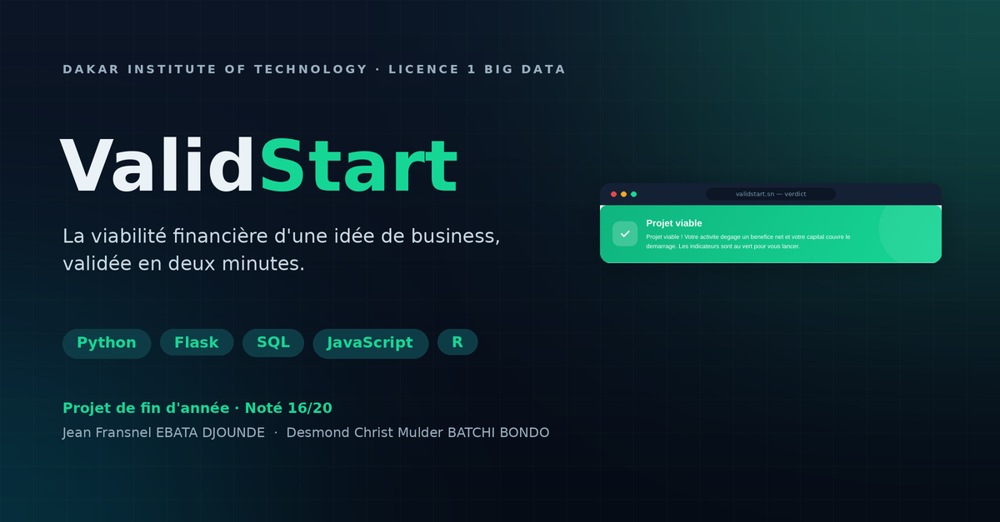
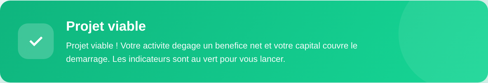
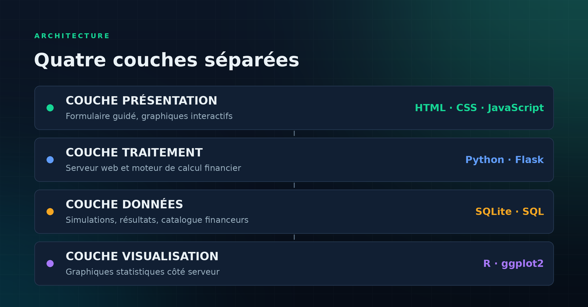
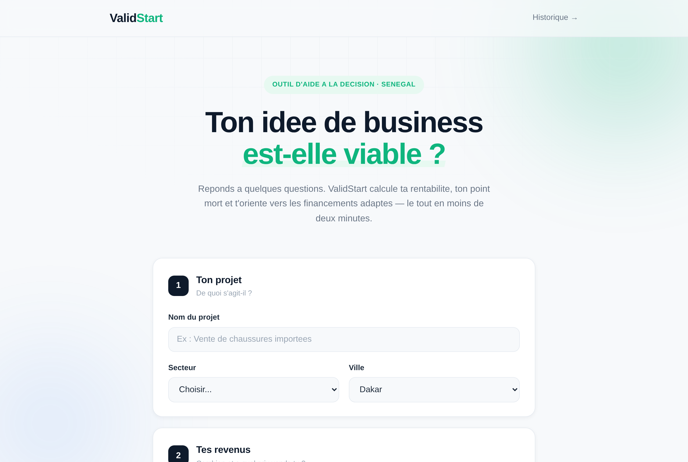
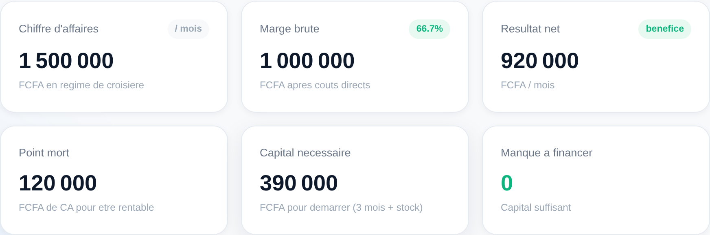
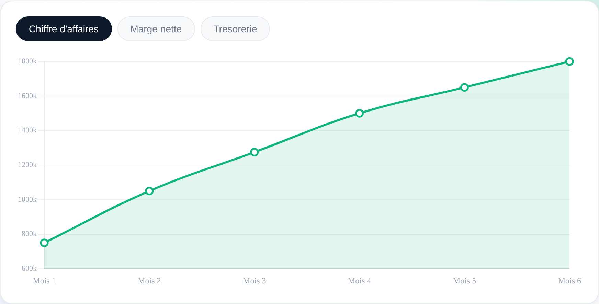
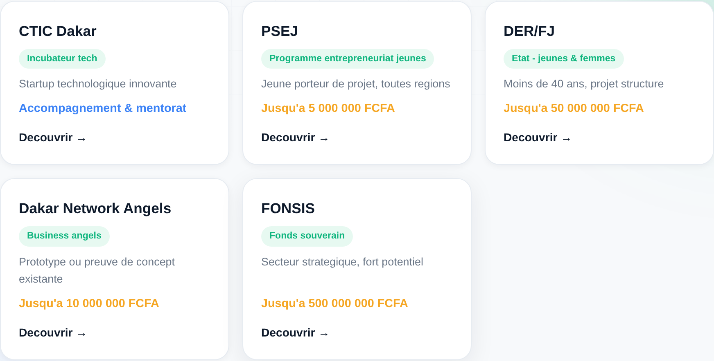

<div align="center">



**Outil web de validation financière pour jeunes entrepreneurs au Sénégal**

[](https://www.python.org/)
[](https://flask.palletsprojects.com/)
[](https://www.sqlite.org/)
[](https://ggplot2.tidyverse.org/)
[](LICENSE)

### [**→ Essayer la démo en ligne**](https://validstart.onrender.com)

<sub>Hébergée sur une instance gratuite : le premier chargement après une période d'inactivité peut demander une trentaine de secondes, le temps que le serveur se réveille.</sub>

</div>

---

## Le problème

Le Sénégal connaît un fort dynamisme entrepreneurial, particulièrement chez les jeunes. Pourtant, la plupart des porteurs de projets se lancent **sans jamais avoir vérifié si leur idée tient financièrement**. Beaucoup investissent leurs économies — ou celles de leur famille — dans une activité dont le modèle économique n'a jamais été chiffré, même sommairement.

Les outils qui existent ne répondent pas à ce besoin : les tableurs exigent des compétences comptables, les logiciels de business plan sont payants et pensés pour d'autres marchés, et les modèles en ligne sont statiques, libellés en euros ou en dollars, sans aucun lien avec les dispositifs de financement locaux.

## La solution

ValidStart répond à trois questions en moins de deux minutes, sans aucune compétence comptable :

1. **Mon idée est-elle viable ?** — un verdict motivé, pas juste des chiffres
2. **De combien de capital ai-je besoin ?** — trésorerie de démarrage calculée
3. **Vers quels financements me tourner ?** — dispositifs sénégalais réels

À partir de six champs simples (prix de vente, quantité mensuelle, coût d'achat, charges fixes, stock initial, capital disponible), l'application calcule les indicateurs clés, projette l'activité sur six mois et rend son verdict.



---

## Fonctionnalités

| | |
|---|---|
| **Aperçu temps réel** | Les indicateurs se calculent en JavaScript pendant la saisie, avant même de valider |
| **Moteur de calcul** | Marge brute, résultat net, point mort, capital nécessaire, trésorerie cumulée |
| **Projection 6 mois** | Montée en charge progressive (50 % → 120 %), hypothèse volontairement prudente |
| **Verdict en 5 cas** | Croise rentabilité **et** trésorerie — détecte le projet rentable mais sous-capitalisé |
| **Double visualisation** | Chart.js interactif côté navigateur + ggplot2 côté serveur |
| **Financeurs réels** | DER/FJ, FONSIS, CTIC Dakar, Dakar Network Angels, PSEJ — selon le besoin en capital |
| **Historique** | Chaque simulation est enregistrée en base et consultable |

---

## Architecture



L'application sépare quatre couches indépendantes : **la logique de calcul ne dépend ni de l'interface, ni de la base de données**. Le module `calculs.py` n'importe ni Flask ni SQLite — il se teste et s'exécute seul.

```
validstart/
├── app.py              # Serveur Flask : routes, base SQLite, appel du script R
├── calculs.py          # Moteur de calcul financier (logique métier pure)
├── graphiques.R        # Génération des 3 graphiques ggplot2
├── templates/          # index.html · rapport.html · historique.html
└── static/
    ├── script.js       # Aperçu temps réel + validation du formulaire
    ├── rapport.js      # Compteurs animés, jauges, graphique à onglets
    ├── lib/            # Chart.js embarqué en local (fonctionne hors ligne)
    └── charts/         # Graphiques PNG générés par R
```

---

## Le moteur de calcul

### Indicateurs

| Indicateur | Formule |
|---|---|
| Chiffre d'affaires | `prix unitaire × quantité mensuelle` |
| Marge brute | `CA − coûts variables` |
| Résultat net | `marge brute − charges fixes` |
| Point mort | `charges fixes / taux de marge` |
| Capital nécessaire | `(charges fixes × 3) + stock initial` |
| Trésorerie cumulée | `capital − stock + Σ marges nettes mensuelles` |

### La logique du verdict

Le moteur teste cinq cas, **du plus grave au plus favorable**, chaque test excluant les suivants :

| Cas | Condition | Verdict |
|:---:|---|---|
| 1 | Marge brute ≤ 0 — le prix ne couvre pas le coût | `NON VIABLE` |
| 2 | Activité déficitaire **et** capital insuffisant | `RISQUE` |
| 3 | Activité déficitaire, capital suffisant | `RISQUE` |
| 4 | Activité rentable **mais** capital insuffisant ou trésorerie négative | `RISQUE` |
| 5 | Activité rentable et capital suffisant | `VIABLE` |

> **Le cas 4 est le cœur du projet.** Un projet peut être bénéficiaire chaque mois et pourtant mourir d'un manque de liquidités au démarrage, si le stock initial a englouti le capital. En suivant la trésorerie cumulée mois par mois, ValidStart détecte ce piège — ce qu'aucun tableur ne fait seul. *Rentable ne veut pas dire finançable.*

---

## Installation

### Prérequis

- Python 3.10 ou supérieur
- R avec la bibliothèque `ggplot2` *(optionnel — l'application fonctionne sans, les graphiques R seront simplement absents)*

### Lancement

```bash
git clone https://github.com/fransnel-dark/validstart.git
cd validstart

python -m venv venv
source venv/bin/activate        # Windows : venv\Scripts\activate

pip install -r requirements.txt
python app.py
```

L'application est accessible sur **http://127.0.0.1:5000**. La base de données est créée automatiquement au premier démarrage.

### Configurer R (optionnel)

Si `Rscript` n'est pas dans votre PATH, indiquez son chemin via une variable d'environnement :

```bash
# Windows
set RSCRIPT_PATH=C:\Program Files\R\R-4.5.2\bin\Rscript.exe

# Linux / macOS
export RSCRIPT_PATH=/usr/bin/Rscript
```

Installation de la dépendance R :

```r
install.packages("ggplot2")
```

---

## Déploiement

L'application est déployée sur Render : **https://validstart.onrender.com**

Le dépôt contient un fichier [`render.yaml`](render.yaml) permettant un déploiement en un clic sur [Render](https://render.com) :

**New → Blueprint → sélectionner ce dépôt → Apply.**

Render lit la configuration, installe les dépendances et lance l'application avec gunicorn :

```bash
gunicorn app:app --bind 0.0.0.0:$PORT --workers 2 --timeout 120
```

Deux limites propres à l'hébergement gratuit, assumées pour une démonstration :

- **Pas de R sur le serveur** — les trois graphiques ggplot2 ne sont pas générés en ligne. L'appel étant *best-effort*, le rapport s'affiche normalement sans eux ; les graphiques interactifs Chart.js, eux, fonctionnent. En local avec R installé, les deux sont présents.
- **Stockage éphémère** — la base SQLite est recréée au redémarrage de l'instance. Pour conserver l'historique, attacher un disque persistant et définir la variable `DATABASE_PATH=/var/data/database.db`.

---

## Tests

Le moteur de calcul se teste **sans lancer le serveur** :

```bash
python calculs.py
```

Quatre scénarios couvrent chaque type de verdict :

| Scénario | Paramètres | Verdict attendu |
|---|---|---|
| Vente à perte | prix 5 000 F, coût 8 000 F | `NON VIABLE` |
| Capital insuffisant | rentable (+310 000 F/mois), capital 300 000 F, stock 120 000 F | `RISQUE` |
| Activité déficitaire | marge positive mais charges fixes de 100 000 F | `RISQUE` |
| Projet sain | marge 67 %, capital 800 000 F | `VIABLE` |

Les quatre verdicts obtenus sont conformes aux verdicts attendus.

---

## Captures

<table>
<tr>
<td width="50%"><br><sub><b>Formulaire guidé en quatre étapes</b></sub></td>
<td width="50%"><br><sub><b>Indicateurs clés du rapport</b></sub></td>
</tr>
<tr>
<td><br><sub><b>Projection interactive (Chart.js)</b></sub></td>
<td><br><sub><b>Recommandation de financeurs</b></sub></td>
</tr>
</table>

---

## Limites connues

- Les coefficients de montée en charge sont **identiques pour tous les secteurs** — une évolution serait de les différencier
- Les données sur les financeurs doivent être **actualisées manuellement**
- L'application n'a pas encore été éprouvée par un panel réel d'utilisateurs
- Prototype conçu pour une **exécution locale** : une mise en ligne publique exigerait authentification, HTTPS, protection CSRF et désactivation du mode debug

## Perspectives

- Comptes utilisateurs et historique personnel
- Export PDF du diagnostic, présentable à un financeur
- Comparaison de plusieurs scénarios côte à côte
- Données sectorielles de référence (marges moyennes par secteur au Sénégal)
- Version mobile
- Renforcement de la sécurité en vue d'une mise en production

---

## Contexte

Projet de fin d'année de **Licence 1 Informatique — Big Data** au [Dakar Institute of Technology](https://dit.sn), réalisé en binôme et soutenu devant jury en juillet 2026. **Note obtenue : 16/20.**

Le projet mobilise de manière intégrée l'ensemble des compétences de l'année : Python, SQL, HTML/CSS/JavaScript et R.

**Auteurs**
- Jean Fransnel EBATA DJOUNDE — moteur Python, logique du verdict, graphiques R, intégration Flask
- Desmond Christ Mulder BATCHI BONDO — base de données SQL, interface HTML/CSS, graphiques JavaScript

## Licence

Distribué sous licence MIT — voir [LICENSE](LICENSE).
